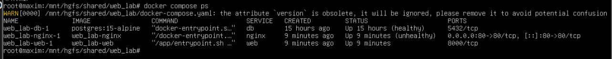
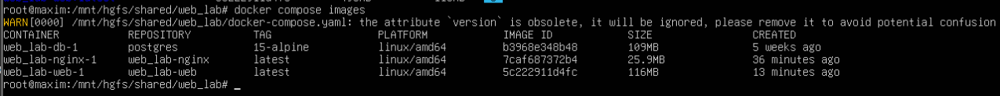
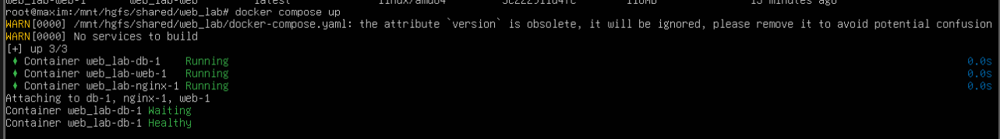
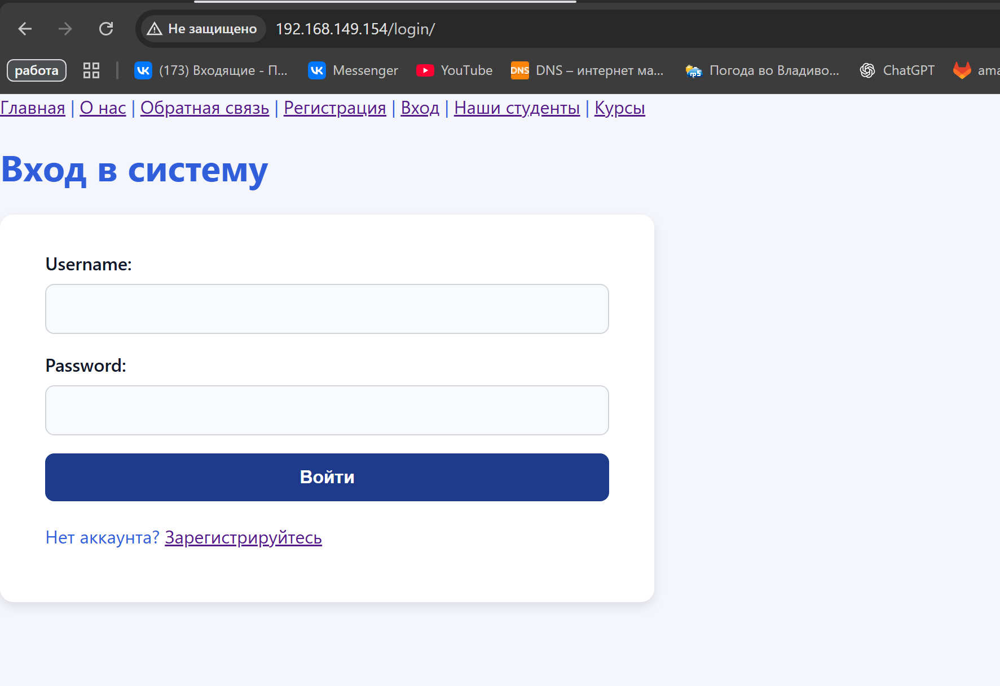
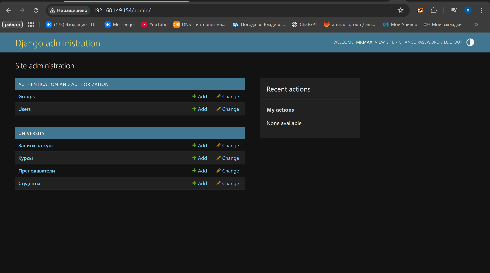

# lab 6 Контейнеризация Django-приложения с Docker

Козел Максим Владимирович
С9121-10.05.01ммзи


### 1. Клонирование репозитория
```bash
git clone https://github.com/eternalsunset671/data_generator.git
```

### 2. Создание файла конфигурации для production на основе текущих переменных окружения
```bash
cp .env .env.prod
```

### 3. Копирование файла с начальными данными в директорию Django-приложения
```bash
cp data.json webtech_lab1/data.json
```

### 4. Сборка Docker-образов и запуск всех сервисов приложения в фоновом режиме

```bash
docker-compose up -d --build
```


### Вывод команды docker-compose ps



### Вывод команды docker images (размеры образов)


### Вывод docker-compose up



### Работающее приложение в браузере


### Админ панель Django
